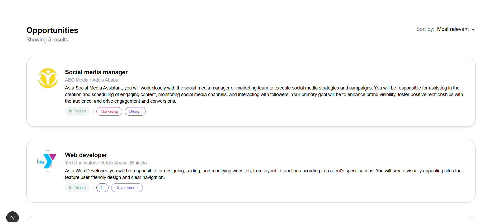
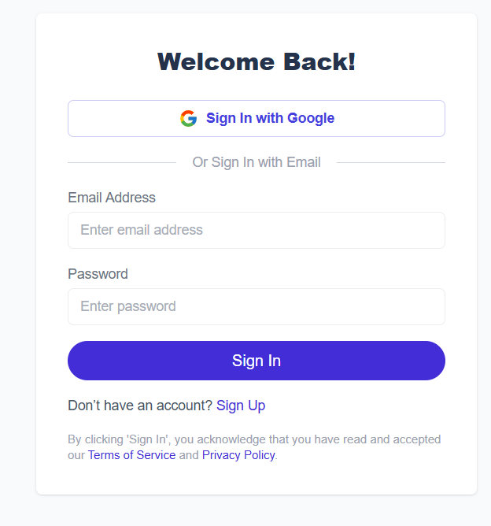
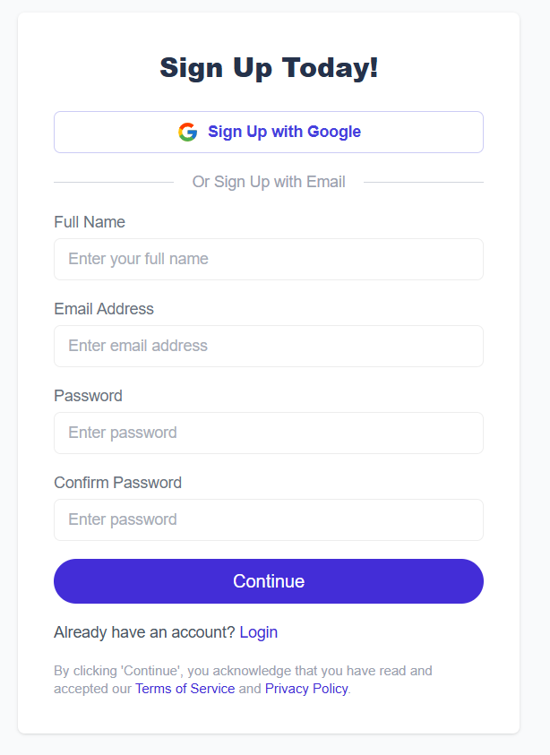

# 🧳 Job Listing Dashboard

A simple **Next.js + Tailwind CSS** app that displays job opportunities in card format and allows users to view detailed job info, powered by data fetched from an external API.

---

## 🚀 Tech Stack

* **Next.js (App Router)**
* **TypeScript**
* **Tailwind CSS**
* **NextAuth.js** for authentication
* **External API Integration**

---

## 📸 Screenshots

### 🖥 Dashboard View



### 📝 Job Detail View


### 🔐 Authentication Pages




---

## 🛠 Setup Instructions

1. **Clone the repository**

```bash
git clone https://github.com/your-username/job-listing-dashboard.git
cd job-listing-dashboard
```

2. **Install dependencies**

```bash
npm install
# or
yarn install
```

3. **Setup environment variables**

Create a `.env.local` file:

```env
NEXTAUTH_URL=http://localhost:3000
NEXTAUTH_SECRET=your_nextauth_secret
```

4. **Run the development server**

```bash
npm run dev
```

---

## 📁 Folder Structure Overview

```bash
.
├── app
│   ├── dashboard
│   │   └── page.tsx         # Protected dashboard page
│   ├── login
│   │   └── page.tsx         # Login route
│   └── signup
│       └── page.tsx         # Signup route
├── components
│   ├── Dashboard.tsx        # Dashboard listing logic
│   ├── JobCard.tsx          # Job card UI
│   └── LoginPage.tsx        # Login/signup shared UI
├── public
│   └── screenshots          # Place your screenshots here
└── README.md
```

---

## 🔐 Authentication

Authentication is handled using **NextAuth.js**. Users are redirected to `/login` if not authenticated when trying to access protected routes like `/dashboard`.

---

## 📦 API Reference

* `GET /opportunities/search`: Fetch all job listings
* `GET /opportunities/:id`: Fetch a single job's detail

---

## 📬 Contributions

Feel free to submit issues or pull requests. Any improvements are welcome!

---

## 📝 License

MIT License
