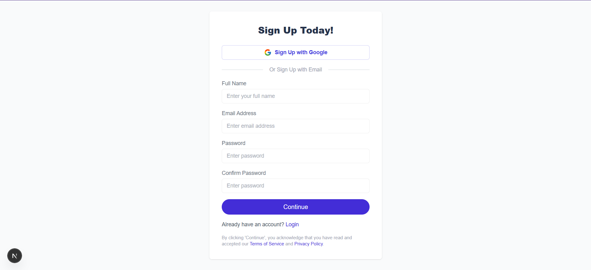
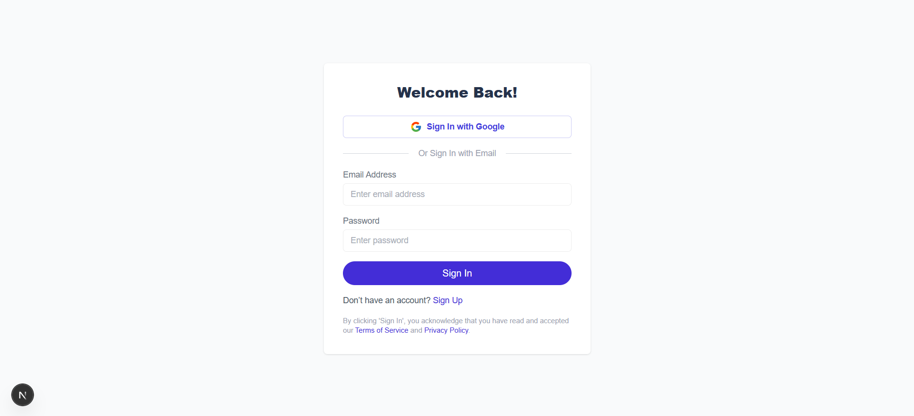
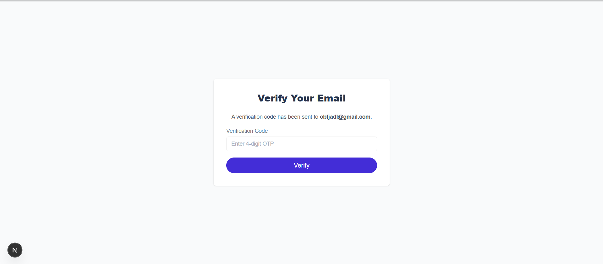
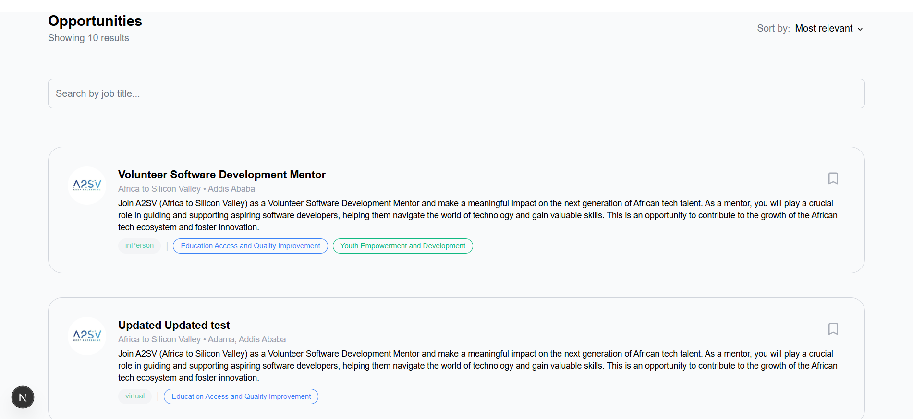
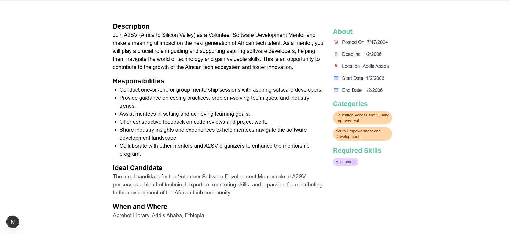

# Job Listing Platform

A modern, full-stack job listing application built with Next.js, NextAuth.js, and Tailwind CSS. This platform allows users to browse, search, and bookmark job opportunities, with a secure authentication system.

**Live Demo:** [Link to your deployed application](https://your-live-demo-url.com)

## Features

- **User Authentication**: Secure sign-up and sign-in functionality using both email/password credentials and Google OAuth.
- **Session Management**: Persistent user sessions managed by NextAuth.js.
- **Protected Routes**: The main dashboard is only accessible to authenticated users.
- **Job Listings**: Fetches and displays a list of available job opportunities from a live backend API.
- **Job Details**: A dedicated page for each job posting with detailed information.
- **Real-time Job Search**: Client-side search functionality to instantly filter job listings by title.
- **Bookmarking**: Authenticated users can bookmark or un-bookmark jobs, with the state persisted.
- **Responsive Design**: A clean and responsive UI built with Tailwind CSS, ensuring a great experience on all devices.
- **Comprehensive Testing**: Includes both unit/component tests with Jest and end-to-end tests with Cypress.

## Screenshots

Here is a visual tour of the application's key pages.

### 1. Sign Up Page

Users can create a new account using their full name, email, and a secure password. The form includes validation for all fields.



### 2. Login Page

Registered users can sign in using their email and password or with a single click using their Google account.



### 3. Email Verification Page

After signing up with an email and password, users are prompted to enter a 4-digit OTP sent to their email to verify their account.



### 4. Dashboard / Job Listings Page

The main page for authenticated users. It displays a list of all available jobs, includes a search bar to filter by title, and shows the bookmark status for each job.



### 5. Job Detail Page

Clicking on any job card navigates to this page, which provides a comprehensive overview of the job, including a detailed description, responsibilities, and requirements.



## Getting Started

Follow these instructions to get a copy of the project up and running on your local machine for development and testing purposes.

### Prerequisites

- [Node.js](https://nodejs.org/en/) (v18.x or later recommended)
- [npm](https://www.npmjs.com/) or [yarn](https://yarnpkg.com/)

### Installation

1.  **Clone the repository:**

    ```bash
    git clone https://github.com/your-username/your-repo-name.git
    cd your-repo-name
    ```

2.  **Install dependencies:**

    ```bash
    npm install
    # or
    yarn install
    ```

3.  **Set up environment variables:**
    Create a file named `.env.local` in the root of your project and add the following variables.

    ```env
    # The URL of the backend API
    NEXT_PUBLIC_API_URL=https://akil-backend.onrender.com

    # Google OAuth credentials (get from Google Cloud Console)
    GOOGLE_CLIENT_ID=your_google_client_id
    GOOGLE_CLIENT_SECRET=your_google_client_secret

    # NextAuth.js secret (generate a random string)
    # You can generate one here: https://generate-secret.vercel.app/
    NEXTAUTH_SECRET=your_super_secret_string
    NEXTAUTH_URL=http://localhost:3000
    ```

### Running the Application

- **Start the development server:**
  ```bash
  npm run dev
  ```
  Open [http://localhost:3000](http://localhost:3000) with your browser to see the result.

## Running Tests

This project includes a full suite of tests to ensure functionality and reliability.

### Unit & Component Tests (Jest)

To run the unit and component tests with Jest and React Testing Library:

```bash
npm test
```
