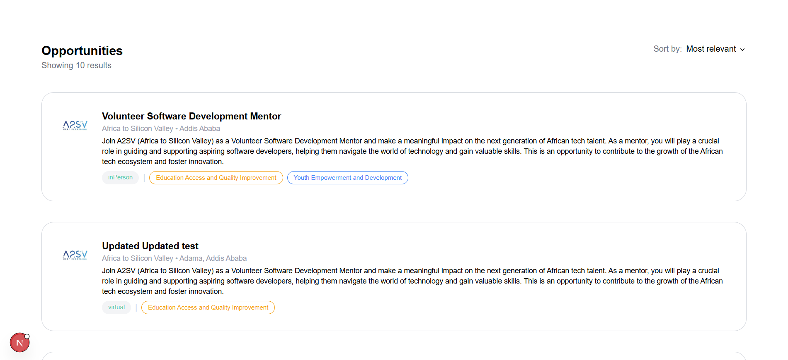

# 🧳 Job Listing Dashboard

A simple Next.js + Tailwind CSS app displaying job cards and their detailed view using dummy JSON data.

## 🛠 Tech Stack

- Next.js
- TypeScript
- Tailwind CSS

## 📸 Screenshots

Add screenshots of:



## 🧪 Run Locally

```bash
npm install
npm run dev

🌐 Pages
/: All job cards

/job/[id]: Detailed job page

🗃 Folder Structure
components/: Reusable UI elements

data/: JSON job data

pages/: Routing

public/: Images and screenshots

📄 License
MIT
```
